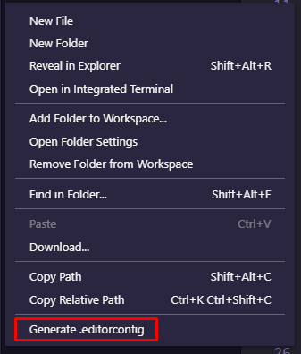

## Configurando o editor `.editorconfig`

Ele vai definir certas regras para o seu editor pra que toda vez que você crie
e inicie um novo arquivo ele siga essas regras.

Clicando com o botão direito do mouse, escolha a opção `Generate .editorconfig`,
assim vai ser criado um arquivo na raiz do projeto com algumas configurações padrão.

  

https://editorconfig.org/