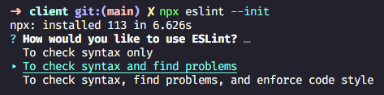
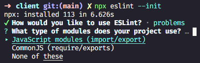
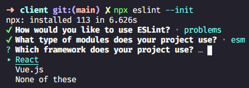
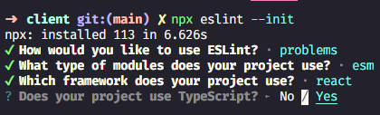
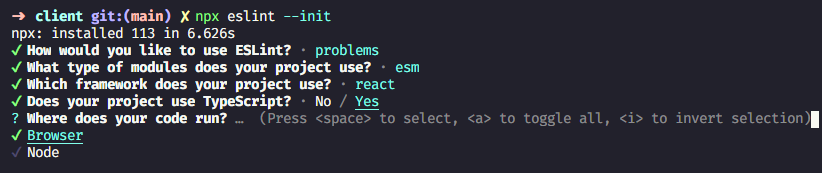
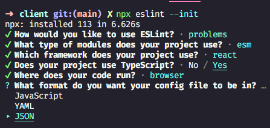
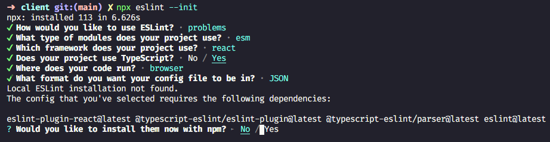
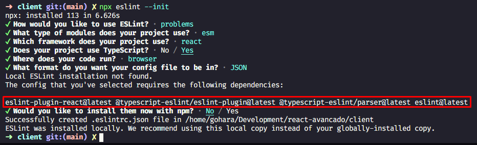

## Confiraundo o `ESLint`

Então ele é aquele cara que vai ficar sublinhando esses errors dentro do seu 
editor e então podemos ver e fazer essas correções.

Temos que instalar o **ESLint** dentro do projeto e definir certas configurações
```bash
npx eslint --init
``` 
Então ao inves de instalar ele globalmente vamos utilizar o binario dele lá do 
repositório pra poder inicializar o nosso **ESLint** e vamos responder algumas
pergunta de acordo com o nosso **Code Base**.

Como vamos utilizar o `Prettier` pra poder fazer a parte do estilo do código vamos
escolher a segunda opção, aonde ele só vai 

> `> To check syntax and find problems`

<p align="left">
  
</p>

Agora ele pergunta quais os estilos de módulo, isso depende muito de cada projeto
e nesse caso como estou criando para exemplificar, vou utilizar 

> `JS modules (import/export)`

<p align="left">
  
</p>

Qual vai ser o framework, nesse caso vou utilizar o
> `React`

<p align="left">
  
</p>

Se vamos utilizar o `Typescript`, nesse caso vou utilizar mas como eu disse,
isso vai de projeto para projeto.

<p align="left">
  
</p>

Se vai ser o `Browser`, `Node` ou os dois e nesse caso vai ser só o `Browser`

<p align="left">
  
</p>

E o formatado do arquivo, nesse caso vou utilizaro como `JSON`, mas vocês podem
usar o formato que vocês preferirem.

<p align="left">
  
</p>

Feito isso ele vai pergunta se queremos instalar esses plugin necessários com `NPM`,
mas como estou utilizando o `YARN` vou dizer que não, mas vou ter que instalar manualmente
e caso esteja utilizando o `NPM` é so dizer sim.

<p align="left">
  
</p>

Feito isso vai ser criado normalmente o nosso arquivo `.eslintrc.json`, mas não
esqueça que temos que instalar esses plugins

<p align="left">
  
</p>

```bash
yarn add eslint-plugin-react@latest @typescript-eslint/eslint-plugin@latest @typescript-eslint/parser@latest eslint@latest
```

## Utilizando sem nenhum plugin

Se você não quiser usar o plugin e mesmo assim continuar tendo o `ESLint`